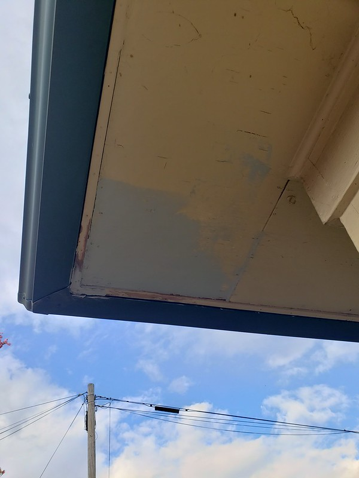
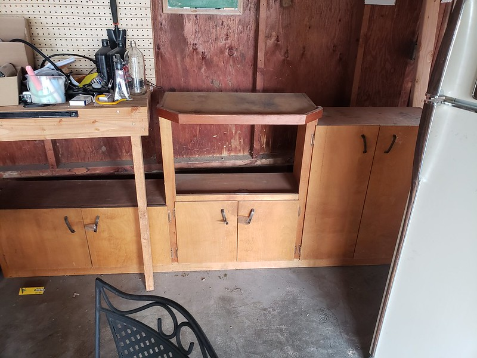
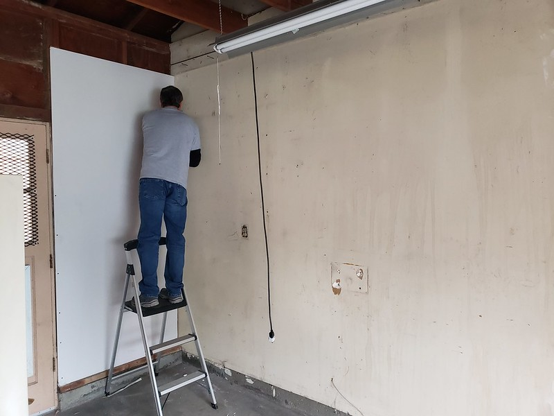
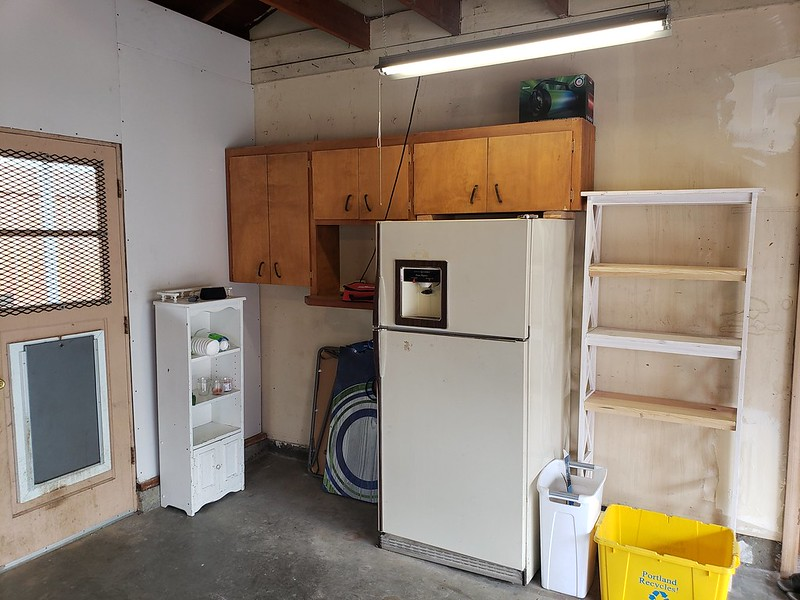

Nikki's dad Steve came and visited a couple weekends ago (I am a little behind in doing this write up). He undertook a number of projects we needed help with. The biggest project was removing the extra front door next to the garage.

We started by busting it out.

Very interestingly there was a section of pipe that was used in order to form the seal with the bottom of the door.

We got the framing up and the wall put in, and we needed something to act as a moisture barrier. Nikki had thrown away an old shower curtain and it was exactly what we needed.

Not to long after we found a roll of plastic that was probably actually meant to be used in this way. So we grabbed that up and finished the door. We still need to put the siding up, but its most of the way finished.

He then kept on going and fixed one of our soffits with Nikki.

It will look like its brand new once it gets coat of paint on it.

We finished up by installing some old cabinets that were in the garage. Covered with dust and cobwebs, the cabinets didnt look like much, but once we got them up on the wall, they provided some much needed storage.

Overall it was an amazing weekend, we got so much done!