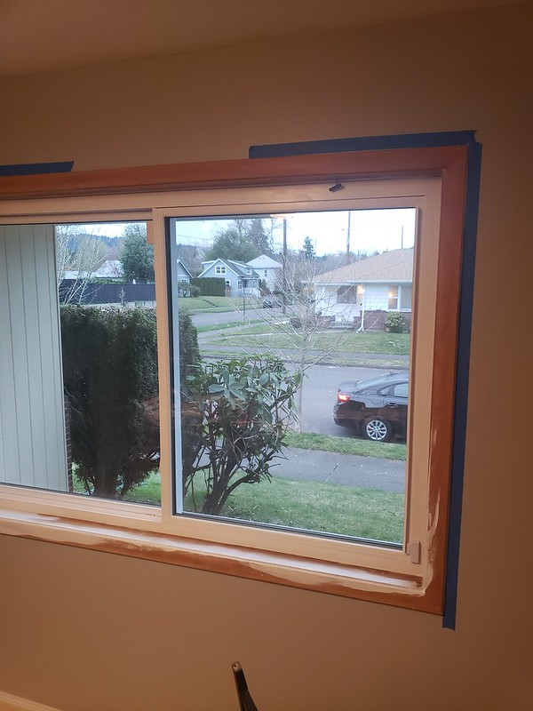
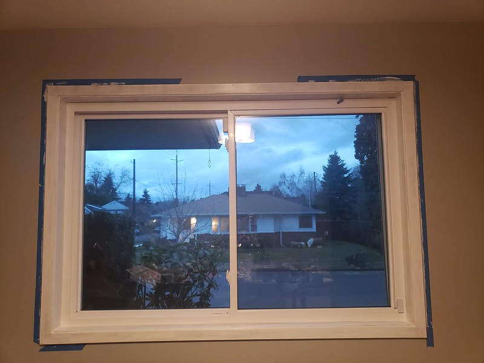

The trim on the inside of all the windows is unfinished, unpainted wood, which doesn't look the most refined. We decided to go with white for the trim inside and Nikki bought paint and a sander and got to work.

After come caulking, some primer, some sanding, and a few coats of paint. They are looking much much better.

